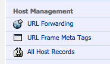

#Making a namecheap URL point at your github project

* Go to your namecheap dashboard
* Select the relevant domain name
* click on All Host Records
* 

##Main domain
namecheap doesn't allow CNAMEs to point at urls that include a / character. In order to make it appear you have a certain root URL, you can do this:
* set the IP ADDRESS/URL column in the @ row to the target URL
* set that RECORD TYPE drop down to URL Frame
* Set the IP ADDRESS/URL column in the WWW row to point to the top level URL (if you don't want a WWW)
* set taht RECORD TYPE drop down to URL Redirect

##Subdomain
To make it look like a subdomain, do this in the SUB-DOMAIN SETTINGS section:
* in the HOST NAME column right what you want the subdomain to be
  * (setting mycoolproject will make the URL mycoolproject.mydomain.com)
* Put your github project URL in the IP ADDRESS/URL column
* Set the RECORD TYPE dropdown to URL Frame

